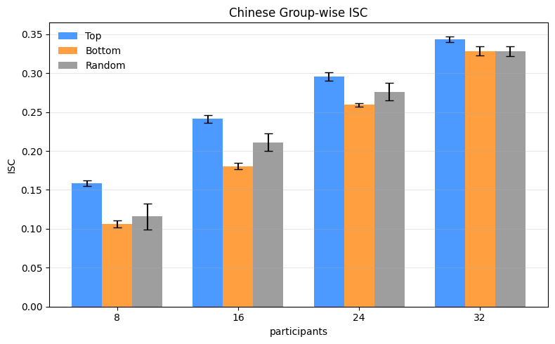
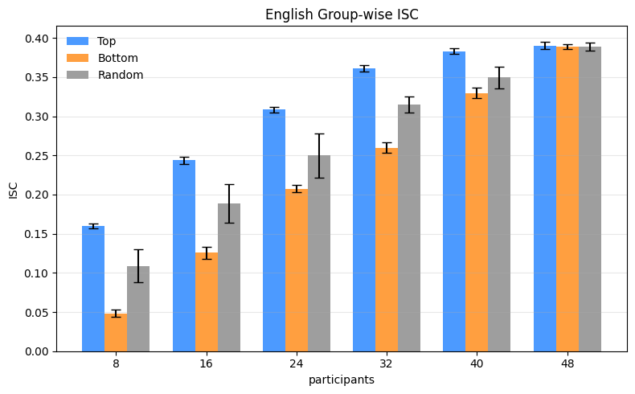

# lpp_isc_top_bottom  
**Group-wise Inter-Subject Correlation (ISC) Analysis**

This repository implements a **group-wise Inter-Subject Correlation (ISC)** analysis pipeline for fMRI data collected during naturalistic language listening (e.g. *Le Petit Prince*).  
It is designed to study **how reliably different listeners’ brains synchronize**, and how ISC depends on **sample size** and **listener proficiency**.

---

## What does this script do?

This script computes **group-wise ISC**, meaning:

1. Subjects are split into **two groups**
2. Brain signals are **averaged within each group**
3. The two group-average time series are **correlated voxel-by-voxel**
4. This is repeated across **multiple runs** and **resampling iterations**

The result is a robust estimate of **neural synchrony at the group level**.

---

## Two analysis modes

### 1. Random sampling (`--mode random`)

**Goal:**  
Understand how ISC depends on **sample size alone**.

**Procedure:**
- For each group size `n`:
  - Randomly sample **2n subjects** from the full pool
  - Randomly split them into two halves (n vs n)
  - Compute voxel-wise ISC
  - Repeat for multiple iterations

---

### 2. Top / Bottom proficiency (`--mode topbottom`)

**Goal:**  
Test whether **listener proficiency** affects neural synchrony.

**Procedure:**
- Subjects are ranked by **behavioral quiz score**
- For each group size `n`:
  - Select **Top 2n** scorers → *Top group*
  - Select **Bottom 2n** scorers → *Bottom group*
- Within each group:
  - Subjects are randomly split into two halves
  - ISC is computed
  - Repeated across iterations

---

## How ISC is computed (step-by-step)

For each iteration:

1. **Shuffle subjects**
2. **Split into two halves**
3. For each of the 9 runs:
   - Load fMRI data
   - Apply spatial mask and preprocessing
   - Average signals within each half
   - Compute voxel-wise Pearson correlation
4. **Average correlations across runs**

Final output:
- One ISC vector per iteration  
- One value per voxel  

---

## Parameters

| Parameter | Meaning |
|---------|--------|
| `N_LIST` | Group sizes (n); total subjects = 2n |
| `RUNS` | Number of runs per subject (default: 9) |
| `n_iter` | Resampling iterations per n |
| `seed` | Random seed for reproducibility |
| `lang` | Language (`EN` or `CN`) |

---

## Usage

```bash
# Random sampling (sample-size effect)
python unified_isc.py --mode random --lang EN --n_iter 30

# Proficiency-based comparison (Top vs Bottom)
python unified_isc.py --mode topbottom --lang EN --n_iter 30

---


### Result

<p align="center">
  
</p>

<p align="center">
  
</p>

